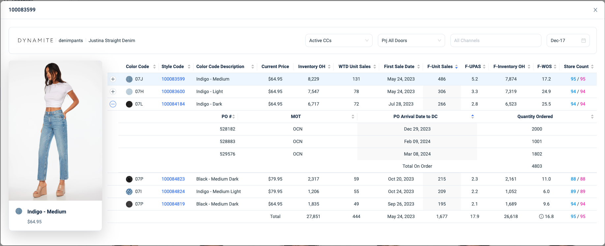

# React Code Challenge

Design the given web page using your preferred data structure.

Feel free to leverage any UI library, and we recommend [Antd](https://ant.design/components/table). While showcasing your design prowess, consider the following guidelines:

Use [sample-data.json](./src/sample-data.json) to populate the table.

1. Each table row signifies a unique SKU (color code). You may ignore the (F-Unit Sales, F-UPAS, F-Inventory OH and F-WOS columns)
2. The store count total should display the MAXIMUM value.
3. Rows may or may not be linked to purchase orders. If applicable, allow rows to expand for viewing associated purchase orders.
4. Implement a sorting mechanism to arrange rows based on price.
5. Upon selecting a row, display its corresponding image.
6. Prioritize crafting clean, modular, and well-documented code.
7. Earn bonus points for achieving responsiveness and an aesthetically pleasing user interface.

Feel free to structure the data creatively; we've provided a sample in `src/sample-data.json`. This challenge assesses your expertise in both native JS/TS and React concepts. Best of luck!

# SQL Challenge
Explore [Top Competitors](https://www.hackerrank.com/challenges/full-score/problem?isFullScreen=true)

# Bonus
- Build a backend to fetch the data displayed on the table.

## Possible Take-Home
For an added challenge, consider the following enhancements:

- Integrate a backend with a database to fetch data dynamically upon search.
- Infuse your creativity by adding extra features to enhance user experience.
